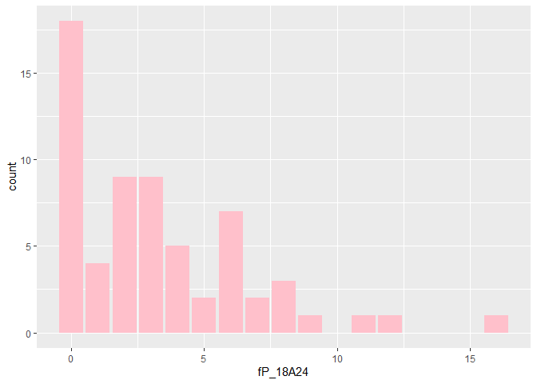
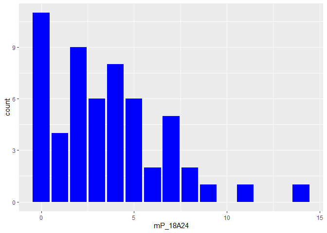
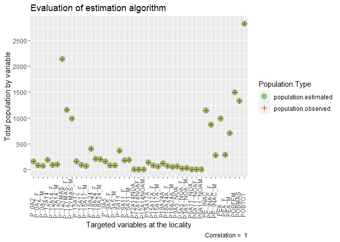
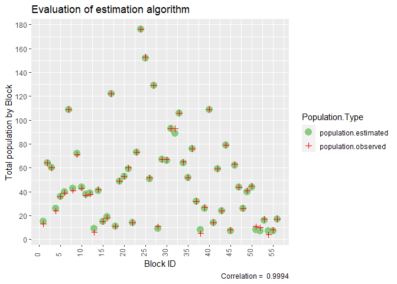

Census private data estimation
================
Author: Néstor de la Paz Ruíz

  - [1. Introduction](#1-introduction)
      - [1.1 Variables selected](#11-variables-selected)
      - [1.2 `NA` Values](#12-na-values)
      - [1.3 `NA` Confidentiality
        criteria](#13-na-confidentiality-criteria)
  - [2 *R script* rules](#2-r-script-rules)
      - [2.1 Functions to fill `NA` cells at each categorical
        variable.](#21-functions-to-fill-na-cells-at-each-categorical-variable)
      - [2.2 Columns(`smcol_`) Targets the consistency in the totals by
        categorical
        variable.](#22-columnssmcol_-targets-the-consistency-in-the-totals-by-categorical-variable)
      - [2.3 Rows (`smrow_`): Consistency in the totals by
        block.](#23-rows-smrow_-consistency-in-the-totals-by-block)
      - [2.3 Extra conditionals (M, F)](#23-extra-conditionals-m-f)
  - [3 Generic cleaning function](#3-generic-cleaning-function)
  - [4 Results](#4-results)
      - [4.1 sGISc Conference Poster](#41-sgisc-conference-poster)

# 1\. Introduction

**Enabling SMS with the estimation of block census private data**

This document shows the steps taken for preparing the census data for
SMS. Census data related to `age-ranges, sex, school, and work` allows
the estimations of DWW pollutants (production and location) depending on
population characteristics.

## 1.1 Variables selected

After analyzing **198** census variables that exist at the block level,
**45** were required in the phase of `cleaning and transformation` to
execute SMS and to provide input data for the DWW ABM. The selected
variables will be used to simulate the dynamics of the `mobility`,
`biological`, and `social` behaviors as `ABM's submodels`.

    ##  [1] "POBTOT"     "POBMAS"     "POBFEM"     "P_12YMAS"   "P_12YMAS_M"
    ##  [6] "P_12YMAS_F" "P_0A2"      "P_0A2_M"    "P_0A2_F"    "P_3A5"     
    ## [11] "P_3A5_M"    "P_3A5_F"    "P_6A11"     "P_6A11_M"   "P_6A11_F"  
    ## [16] "P_12A14"    "P_12A14_M"  "P_12A14_F"  "P_15A17"    "P_15A17_M" 
    ## [21] "P_15A17_F"  "P_18A24"    "P_18A24_M"  "P_18A24_F"  "P3A5_NOA"  
    ## [26] "P3A5_NOA_M" "P3A5_NOA_F" "P6A11_NOA"  "P6A11_NOAM" "P6A11_NOAF"
    ## [31] "P12A14NOA"  "P12A14NOAM" "P12A14NOAF" "P15A17A"    "P15A17A_M" 
    ## [36] "P15A17A_F"  "P18A24A"    "P18A24A_M"  "P18A24A_F"  "PEA"       
    ## [41] "PEA_M"      "PEA_F"      "PE_INAC"    "PE_INAC_M"  "PE_INAC_F"

## 1.2 `NA` Values

*NA* cells exits as a mean of privacy protection. The raw data by block
demonstrate presence of *NA* values equal to **829** cells. A preview of
data missing due to privacy looks like the following:

| P\_0A2 | P\_0A2\_M | P\_0A2\_F | P\_3A5 | P\_3A5\_M | P\_3A5\_F | P\_6A11 | P\_6A11\_M | P\_6A11\_F |
| -----: | --------: | --------: | -----: | --------: | --------: | ------: | ---------: | ---------: |
|      0 |         0 |         0 |     NA |         0 |        NA |      NA |         NA |          0 |
|      4 |        NA |        NA |      4 |         3 |        NA |       6 |          4 |         NA |
|      3 |        NA |        NA |      4 |         3 |        NA |       6 |          3 |          3 |
|     NA |        NA |         0 |     NA |         0 |        NA |       0 |          0 |          0 |
|     NA |         0 |        NA |      0 |         0 |         0 |       8 |          5 |          3 |
|     NA |        NA |         0 |     NA |         0 |        NA |      NA |         NA |          0 |
|      7 |         3 |         4 |      3 |         3 |         0 |      12 |          4 |          8 |
|     NA |        NA |         0 |     NA |         0 |        NA |       7 |          4 |          3 |
|     NA |        NA |         0 |      7 |         4 |         3 |       8 |          5 |          3 |
|      3 |        NA |        NA |     NA |         0 |        NA |       7 |          4 |          3 |

<br>

## 1.3 `NA` Confidentiality criteria

The main confidentiality criteria defined by the *Ley del Sistema
Nacional de Información Estadística y Geográfica (LSNIEG)* are the
following (INEGI,2020):

    • At the municipality or territorial demarcation level, locality and AGEB, any indicator with less than three units appears with an asterisk with the exception of the variables Total population (POBTOT), Total dwellings (VIVTOT) and Total inhabited dwellings (TVIVHAB).
    
    • At the block level, the previous criterion also applies; additionally, for those with one or two inhabited dwellings, only presents information in the variables Total population (POBTOT) and Total dwellings (VIVTOT), in the rest of the indicators appear asterisks.

The above criteria is considered to fill NA cells. Note that in this
document `*` are replace by `NA` cells.

# 2 *R script* rules

The prediction of DWW pollutants depends on the quantification of
population totals and their characteristics. `NA` cells represent
missing population that leads to an underestimation of pollutants, for
that reason `NA` cells are replaced with values following the rules in
this section. Once values are filled, it is possible to fulfill the
requirements to execute SMS for a further estimation of DWW pollutants.

## 2.1 Functions to fill `NA` cells at each categorical variable.

As a general overview, `NA` cells are filled with a number of population
that matches the totals:

| Targeted totals | Description                                                                 |
| --------------- | --------------------------------------------------------------------------- |
| By column       | Representing the totals of the categorical values.                          |
| By row          | Making sure that the totals a block are not overestimated.                  |
| By gender       | Consideration in the desagregation of the totals by gender (and their sum). |

The variables selected represent the following categories:

  - `Population totals`
  - `Age-ranges and sex`
  - `Assistance or not to school`
  - `Actively economically or not (work)`

Each category requires its own script for data cleaning and
transformation. This document explains the categorical variable
`Age-ranges and sex`. The functions for the rest of the categorical
variables are adjusted based on the similar logic. If there is interest,
it is also possible to explore the code for a better understanding of
the particularities of each script by targeted category.

The following script take a glance of the core rules for cleaning
`Age-ranges and sex` (code description provided after the script):

    To interpret the code it is relevant to note the following terminology:

| Notation in the script       | Description                                                               |
| ---------------------------- | ------------------------------------------------------------------------- |
| `smcol_, smrow_`             | Built functions to sum rows-columns across the categorical variable.      |
| `_mf, _m, _f`                | Endings that refer at each section of a function by gender.               |
| `.mf, .m, .f`                | If contained, it refers at each variable by its gender.                   |
| `vec.mf.n, vec.m.n, vec.f.n` | Vectors variables that saves the new `.n` values.                         |
| `t.tot`                      | Totals of the categorical value (columns).                                |
| `hpcons`                     | Original data table with all categorical variables.                       |
| `df.c$col.f`                 | Ending that refers to a cleaned and/or calculated dataframe and variable. |

``` r
##########################################
#RULES FOR TOTALS BY SUM OF MALE AND FELAME (MF)
##########################################

#Conditionals for totals MF: Filling missing values
  while (t.tot.mf > smcol_mf(i)){#while vales are not == real total population
    for (i in 1:nrow(hpcons)){#For each cell in the target variable column
      if (is.na(vec.mf[i])#Targeting the missing fields to fill
          &(t.tot.mf > smcol_mf(i))#Keep sum col values under real total
          &(POBTOT.c$POBTOT.f[i] > smrow_mf(i))#keep row sum variable under POB totals
          &(3 > vec.mf.n[i])#Only values less than 3 are confidential
      ) {vec.mf.n[i] <- vec.mf.n[i]+1}#Add individual
    }
  }

##########################################
#RULES FOR TOTALS BY MALE (M)
##########################################

#Conditionals for totals M: Filling missing values
#First make sure to cover all female conditions
  while (t.tot.m > smcol_m(i)){#while vales are not = real total population
    for (i in 1:nrow(hpcons)){#For each cell in the target variable column
      if (is.na(vec.m[i])#Targeting the missing fields to fill
          & !is.na(vec.f[i])#For female precondition for male cells
          & (POBTOT.c$POBMAS.f[i] > smrow_m(i))#Keep sum col values under real total
          #First fill all values where total and females are defined
          & (((vec.mf + vec.mf.n)[i] - vec.f[i]) != vec.m.n[i])
      ){while (((vec.mf + vec.mf.n)[i] - vec.f[i]) != vec.m.n[i]){
        vec.m.n[i] <- vec.m.n[i]+1
        }
      }
    }
    for (i in 1:nrow(hpcons)){
      if(is.na(vec.m[i])#Targeting the missing fields to fill
         & is.na(vec.f[i])#2nd possibility with female values
         & (t.tot.m > smcol_m(i))#Keep sum col values under real total
         & (POBTOT.c$POBMAS.f[i] > smrow_m(i))#Keep sum row values under real total
         & (vec.m.n[i] != vec.df.mf.n[i,c(1)])#must be different that the MF total of the cell
         & (3 > vec.m.n[i])#Only values less than 3 are confidential
      ){#keep by block values under POB totals
        vec.m.n[i] <- vec.m.n[i]+1#Add individual
      }
    }
  }

##########################################
#RULES FOR TOTALS BY FEMALE (F)
##########################################

#Conditionals for totals F: Filling missing values
  while (t.tot.f > smcol_f(i)){#while vales are not = real total population
    for (i in 1:nrow(hpcons)){#For each cell in the target variable column
      if (is.na(vec.f[i])#Targeting the missing fields to fill
          & (t.tot.f > smcol_f(i))#Keep sum col values under real total
          & (POBTOT.c$POBFEM.f[i] > smrow_f(i))#Keep sum row values under real total
          #Special condition: verify that male[i] keeps under total MF[i]
          & ( (vec.mf+vec.mf.n)[i] != ((vec.m+vec.m.n)[i] + vec.f.n[i]))
          #Special condition: Calculate difference of new totals
          & (( (vec.mf+vec.mf.n)[i] - (vec.m+vec.m.n)[i]) != 0)
          & (3 > vec.m.n[i]))#Only values less than 3 are confidential
      {vec.f.n[i] <- vec.f.n[i]+1#Add individual
      }
    }
  }
```

As can be seen in the script headers, the rules are separated in three
sections, 1. Sum of male and female, 2. Male, 3. Female. All categorical
variables are disaggregated by gender, and the structure of their
functions follows the same structure.

It can be noted that for the three sections, the script of `Male +
Female` is repeated for `Male` and `Female` except that some additions
are required depending on the gender column. For that reason the
explanation of the `Male + Female` code in the following section is
enough to understand the rest of the code.

It is relevant to mention that the order to execute the code is
relevant. They exist differences on the `Male` and `Female` script that
are discussed in the following section. For the rest, the design of the
script is self-explained.

## 2.2 Columns(`smcol_`) Targets the consistency in the totals by categorical variable.

This section describes the function `smcol_`. The function:
`while(t.tot.mf > smcol_mf(i))` is the initial condition in each section
of the code. The function makes sure that `NA` vales are filled until
matching the totals of the categorical variable.

### Tables: `t.tot` & `variable table`

Each categorical variable consist of three columns separated by their
count of totals (male + female), count of totals by male, and by female,
e.g;`P_18A25`, `P_18A25_M`, `P_18A25_F`. The total table (`t.tot`)
consist of one row, and number of columns equal to the categorical
variables. Example of the data tables:

| P\_18A24 | P\_18A24\_M | P\_18A24\_F |
| -------: | ----------: | ----------: |
|      406 |         199 |         207 |

Section of `t.tot` with the totals by a categorical variable (columns):

| P\_18A24 | P\_18A24\_M | P\_18A24\_F |
| -------: | ----------: | ----------: |
|       NA |          NA |          NA |
|       10 |           4 |           6 |
|        8 |           5 |           3 |
|        4 |          NA |           3 |
|        4 |           3 |          NA |
|       10 |          NA |           8 |

Section of the `variable table` with NA values for a categorical
variable (block data):

### The `while` conditionals

As the census data provides the total population for each categorical
variable in a locality, it is possible to add values into `NA` cells
until matching the total criteria in the locality of study. For that
purpose a `while` conditional is used for each categorical variable and
their three columns:

``` r
Totals:   while (t.tot > smcol(i)), vec.n[i] <- vec.n[i]+1
Male:     while (t.tot.m > smcol_m(i)), vec.m.n[i] <- vec.m.n[i]+1
Female:   while (t.tot.f > smcol_f(i)), vec.f.n[i] <- vec.f.n[i]+1
```

| Where:       | Description                                                     |
| ------------ | --------------------------------------------------------------- |
| `t.tot`      | Population totals of the categorical variable.                  |
| `smcol(i)`   | Sum of column values of the variable in the cell iteration `i`. |
| `vec.n`      | New vector value in the cell `i` that replace the `NA`.         |
| `vec.n[i]+1` | Adds a unit in the new vector cell.                             |

For each iteration (i) in a cell of the column, the script targets an
`NA` cell, adds `1` and goes to the next `NA` cell to repeat the process
until the totals of the categorical variables are not longer bigger than
the sum of the column by block. As a result, the population for targeted
categorical variable fills the missing population at the blocks.

### The `if` conditionals

There are some conditionals that must be true in each iteration of the
cells to define if a value can be added at the cell `i` during the
`while` loop, which are the following:

``` r
if(is.na(vec.mf[i])#Targeting the missing fields to fill
&(t.tot.mf > smcol_mf(i))#Keep sum col values under real total
&(POBTOT.c$POBTOT.f[i] > smrow_mf(i))#keep row sum variable under POB totals
&(3 > vec.mf.n[i])#Only values less than 3 are confidential
```

The `is.na` function make sures that only `NA` cells are selected. The
`(t.tot.mf > smcol_mf(i))` function is required to make sure that during
an specific iteration `i` such condition have been fulfilled or not. The
function `(3 > vec.mf.n[i])` express the confidentiality criteria.
Finally the function `(POBTOT.c$POBTOT.f[i] > smrow_mf(i))` is explained
in the following section.

## 2.3 Rows (`smrow_`): Consistency in the totals by block.

The totals by row allows to control a gradual addition of individuals in
`NA` cells under the threshold of the total population in each block for
every categorical variable.

### Tables: `POBTOT` & `variable table`

In each block (rows), totals by gender are provided for locality, which
can be appreciated in the following table:

<table class="kable_wrapper">

<caption>

`POBTOT` table with blocks 1 to 7, and `variable table` with a
categorical variable (P\_18A24) showing `missing population`NA\` cells
from the same blocks.

</caption>

<tbody>

<tr>

<td>

|   | POBTOT | POBMAS | POBFEM |
| :- | -----: | -----: | -----: |
| 1 |     13 |      5 |      8 |
| 2 |     64 |     31 |     33 |
| 3 |     60 |     29 |     31 |
| 4 |     24 |      8 |     16 |
| 5 |     36 |     17 |     19 |
| 6 |     39 |     17 |     22 |
| 7 |    109 |     52 |     57 |

</td>

<td>

|   | P\_18A24 | P\_18A24\_M | P\_18A24\_F |
| :- | -------: | ----------: | ----------: |
| 1 |       NA |          NA |          NA |
| 2 |       10 |           4 |           6 |
| 3 |        8 |           5 |           3 |
| 4 |        4 |          NA |           3 |
| 5 |        4 |           3 |          NA |
| 6 |       10 |          NA |           8 |
| 7 |       16 |           8 |           8 |

</td>

</tr>

</tbody>

</table>

### The `block` conditional

The totals by block and gender allows to specify a rule to make sure
that the sum of each categorical variable by block does not overestimate
the population in the previews conditionals (`while` and `if`
conditions). For that reason, a `smrow_` function is used to sum the
rows that belongs to the targeted categorical variables which sum
matches the total population in the block. The rules are the following:

| Gender      | Function                    |
| ----------- | --------------------------- |
| Male+female | `(POBTOT[i] > smrow_mf(i))` |
| Male        | `(POBMAS[i] > smrow_m(i))`  |
| Female      | `(POBFEM[i] > smrow_f(i))`  |

| Where                    | Description                                                                                     |
| ------------------------ | ----------------------------------------------------------------------------------------------- |
| `POBTOT, POBMAS, POBFEM` | Total population, total males and females.                                                      |
| `smrow_`                 | Function that sums all rows of the categorical variables at the iteration cell based on gender. |

Once the `smrow_` function provides the outcome of the rows’ sum in the
iteration of the cell, the value is compared with the respective total
in the block, if the total is bigger than the row sums, a sum of
`vec.n[i] <- vec.n[i]+1` is allowed.

Note that the sum of all rows with the header format of `P_#A#`
(e.g. `P_18A24`) is equal to the POBTOT of that block. The same
corresponds to male and female functions.

## 2.3 Extra conditionals (M, F)

There are some extra conditions that apply specifically for the male
column and others for the female column which are explained next.

### Male conditionals

The male column is in the middle between totals and females, which
follows the order of the execution of the function. Some times, female
values were already provided, and the totals columns were defined. The
before implies that male `NA` blocks where female are known, the male
cells must be calculated before a regular iteration `while` conditional.
To solve that issue, the following lines of codes are provided:

``` r
!is.na(vec.f[i])#For female precondition for male cells
#First fill all values where total and females are defined
& (((vec.mf + vec.mf.n)[i] - vec.f[i]) != vec.m.n[i])
```

### Female conditionals

In the case of the female column, sometimes the blocks of totals and
male already filled the space of the block, which means there is no more
space for female. The conditional verifies which is the status of the
totals and males to select priority blocks where female are required.
The following code solves that issue.

``` r
#Special condition: verify that male[i] keeps under total MF[i]
& ( (vec.mf+vec.mf.n)[i] != ((vec.m+vec.m.n)[i] + vec.f.n[i]))
#Special condition: Calculate difference of new totals
& (( (vec.mf+vec.mf.n)[i] - (vec.m+vec.m.n)[i]) != 0)
```

# 3 Generic cleaning function

Finally, the declaration of the generic function that was built to clean
the data for all the columns of the categorical variables `Age-ranges
and sex` is declared as follows:

``` r
clean.pvar <- function( = hpcons$P_12YMAS,
                       vec.m = hpcons$P_12YMAS_M,
                       vec.f = hpcons$P_12YMAS_F,
                       t.tot.mf = hptotcons$P_12YMAS,
                       t.tot.m = hptotcons$P_12YMAS_M,
                       t.tot.f = hptotcons$P_12YMAS_F,
                       nam.mf.n = "P_12YMAS.f",
                       nam.m.n ="P_12YMAS_M.f",
                       nam.f.n ="P_12YMAS_F.f")
```

As mentioned in section 2.1, each categorical variable has an specific
generic function.

# 4 Results

In the process of data transformation, it was possible to verify that
negative values are not present from the differences of categorical
values. It was also verified that the sum of all the values matches the
totals of columns, and rows.

Here is a summary before data cleaning for the variable `P_18A24_F`:

    ##    Min. 1st Qu.  Median    Mean 3rd Qu.    Max.    NA's 
    ##   0.000   3.000   5.000   5.286   6.500  16.000      21

Summary after cleaning `P_18A24_F` (eliminated `NA` values):

    ##    Min. 1st Qu.  Median    Mean 3rd Qu.    Max. 
    ##   0.000   1.000   3.000   3.696   6.000  16.000

<!-- -->

Here is a summary before data cleaning for the variable `P_18A24_M`:

    ##    Min. 1st Qu.  Median    Mean 3rd Qu.    Max.    NA's 
    ##   0.000   3.500   5.000   4.886   7.000  14.000      21

Summary after cleaning `P_18A24_M` (eliminated `NA` values):

    ##    Min. 1st Qu.  Median    Mean 3rd Qu.    Max. 
    ##   0.000   1.000   3.000   3.554   5.000  14.000

<!-- -->

## 4.1 sGISc Conference Poster

This section refers to the results figures presented at the IGISc
International Conference on Geospatial Information Sciences at
CentroGeo, Mexico.

### 4.1.1 Evaluation

Section 2.1 introduce the target of the algorithm which is the base to
apply an evaluation. The evaluation applies for the `age-ranges and
gender`, `school`, and `work` related variables. The variables are
compared with their respective total values at the spatial units of
locality and block. The results evaluation demonstrate that the
algorithm target is fulfilled considering the following two criteria:

  - `1. Comparing values between the observed census data of the totals
    by locality per variable with estimated values.`

| Observed totals by locality        | Estimated totals by locality                                                                                |
| ---------------------------------- | ----------------------------------------------------------------------------------------------------------- |
| Known value of a targeted variable | Defined with the sum of estimated values of many blocks that compound the target variables (sum by columns) |

The bellow graph shows a comparison of observed and estimated totals by
locality of the variables of interest.

<!-- -->

  - `2. Comparing values between the observed census data of the totals
    by block per variable with estimated values.`

| Observed totals by blocks          | Estimated totals by blocks                                                                               |
| ---------------------------------- | -------------------------------------------------------------------------------------------------------- |
| Known value of a targeted variable | Defined with the sum of estimated values of many blocks that compound the target variables (sum by rows) |

The bellow graph shows a comparison of observed and estimated totals by
block of the variables of interest.

<!-- -->
<br>

The bellow table is a sample of filled NA values.

| P\_0A2.f | P\_0A2\_M.f | P\_0A2\_F.f | P\_3A5.f | P\_3A5\_M.f | P\_3A5\_F.f | P\_6A11.f | P\_6A11\_M.f | P\_6A11\_F.f |
| -------: | ----------: | ----------: | -------: | ----------: | ----------: | --------: | -----------: | -----------: |
|        0 |           0 |           0 |        2 |           0 |           2 |         2 |            2 |            0 |
|        4 |           2 |           2 |        4 |           3 |           1 |         6 |            4 |            2 |
|        3 |           1 |           2 |        4 |           3 |           1 |         6 |            3 |            3 |
|        2 |           2 |           0 |        2 |           0 |           2 |         0 |            0 |            0 |
|        2 |           0 |           2 |        0 |           0 |           0 |         8 |            5 |            3 |
|        2 |           2 |           0 |        2 |           0 |           2 |         2 |            2 |            0 |
|        7 |           3 |           4 |        3 |           3 |           0 |        12 |            4 |            8 |
|        2 |           2 |           0 |        2 |           0 |           2 |         7 |            4 |            3 |
|        2 |           2 |           0 |        7 |           4 |           3 |         8 |            5 |            3 |
|        3 |           1 |           2 |        2 |           0 |           2 |         7 |            4 |            3 |
